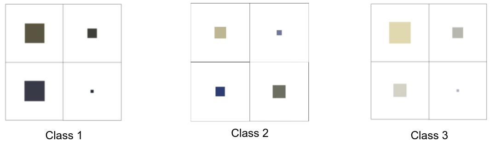

# apple_case_study

## Problem Definition
Classify Images into three classes. Image contain one square of varying size and color

## Insights from Data
Each class represents square of certain color range. 
Extract RGB values of the color and apply ML classifier

    

## Methods

### Approach 1 - ML Image Classifier
Method:
* Image Processing (I/P: Image, O/P: RGB value of color of the square)
  * Threshold the image - segment the white background
  * Find the contours of the square
  * Extract the contour from the input image
  * Calculate mean R, mean G, mean B values
* ML Classifier

Best Accuracy: 82%

Conclusion: RGB values might not be powerful features. Use SIFT + SVM on the input image. Even better use a DL model

### Approach 2 - SIFT + SVM
Method:
* SIFT Feature Descriptors
* K-Means Clustering
* Bag of Features
* SVM Classifier

Best Accuracy: 37.36%

### Approach 3 - DL Image Classifier
Method: Train custom DL model on the dataset

Best Accuracy: 35%

## Future Works
* Fix the DL model

## References
* Extract square
  * https://stackoverflow.com/questions/55169645/square-detection-in-image
  * https://stackoverflow.com/questions/55832414/extract-a-fixed-number-of-squares-from-an-image-with-python-opencv 
* ML Image Classifier
  * https://stackabuse.com/implementing-svm-and-kernel-svm-with-pythons-scikit-learn 
  * https://stackabuse.com/k-nearest-neighbors-algorithm-in-python-and-scikit-learn 
  * https://machinelearningmastery.com/one-vs-rest-and-one-vs-one-for-multi-class-classification/ 
  * https://www.kaggle.com/kanncaa1/feature-selection-and-data-visualization 
* SIFT + SVM
  * https://github.com/Akhilesh64/Image-Classification-using-SIFT/blob/main/main.py 
* DL Image Classifier
  * https://github.com/Haylemicheal/Cats-vs-Dogs-Classifier/blob/master/Cats%20vs%20Dogs%20classifier.ipynb 
